#### Introduction

When working with STM32 microcontrollers, you might develop projects in STM32CubeIDE but later need to migrate them to Keil (MDK-ARM) for advanced debugging, performance optimization, or better integration with CMSIS and RTOS. In this guide, I’ll walk you through the step-by-step process of creating an STM32CubeIDE project in Keil for the NUCLEO-F446RE board.

When working with STM32 microcontrollers, you might develop projects in STM32CubeIDE but later need to migrate them to Keil (MDK-ARM) for advanced debugging, performance optimization, or better integration with CMSIS and RTOS. In this guide, I’ll Walk you through the step-by-step process of opening an STM32CubeIDE project in Keil for the NUCLEO-F446RE board.

To begin with:
1. You need to install STM32CubeMX, which is a graphical tool that helps configure peripherals and generate initialization code.

2. Download the latest version of STM32CubeMX. 

3. Run the installer and follow the on-screen instructions. 

4. Once installed, launch STM32CubeMX.

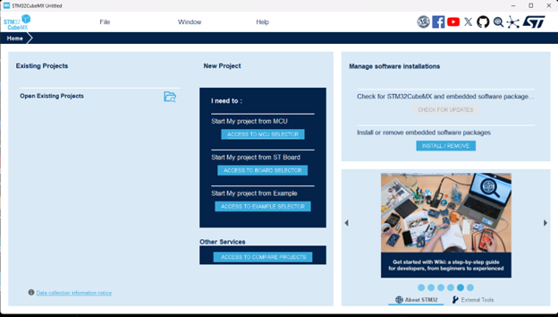

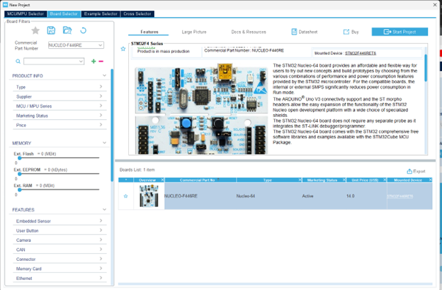

If you haven’t already created a project in STM32CubeIDE, you’ll need to:

1. Open STM32CubeMX.

2. Select “Start My Project from ST Board”.

3. Choose the board NUCLEO-F446RE.

4. Configure the necessary peripherals in the Pinout & Configuration section. If you already have an STM32CubeIDE project, you can directly open it.

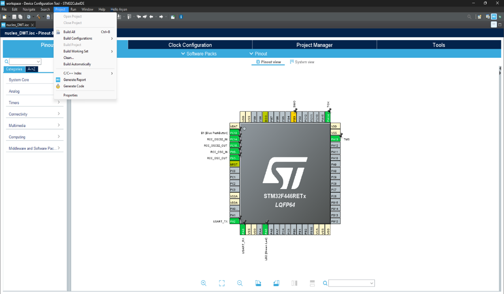

5. Click the project manager’s tab you will see the window below.

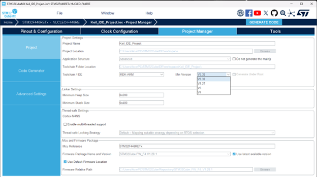

6. Click on the "Project Manager" tab at the top (next to "Clock Configuration").

7. Scroll down to the "Toolchain/IDE" section.

   Choose between:

     MDK-ARM V5 (for older Keil versions).

     MDK-ARM V6 (for ARMClang-based newer Keil versions).

8. Set a project name and destination folder (optional).

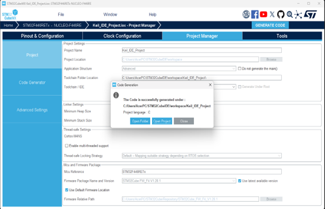

9. Click "Generate Code" (button at the top-right).STM32CubeMX will   create a .uvprojx file inside your project folder.

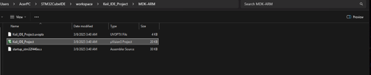

Once completed, open Keil uVision and load the generated project.

Open the Keil Project

1. Click Project → Open Project.

2. Navigate to your STM32CubeMX output folder.

3. Open the. uvprojx file.

Set up debugging for NUCLEO-F446RE board
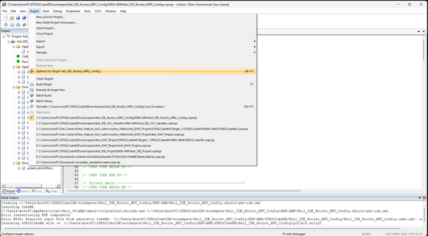

1. Click on the Project tab ,select Options for Options for Target 'Target 1'.

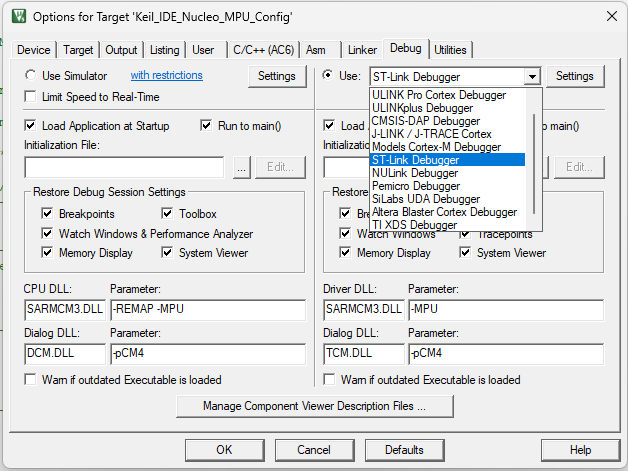

2. Select Debug tab.

3. Choose ST-Link Debugger.

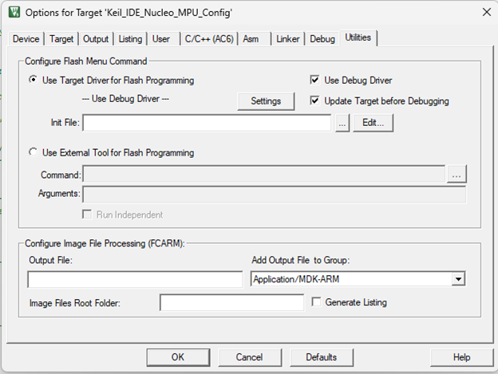

Enable Flash Download:

4. Go to Utilities tab.

5. Under Use Target Driver, select ST-Link Debugger.

6. Click Settings, ensure STM32F4xx Flash Algorithm is selected.

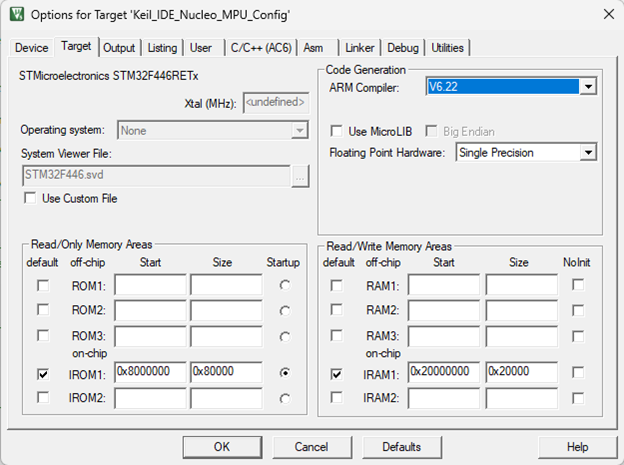

7. Select the Target tab and select the ARM Compiler section under code generation.

8. Select V6.22compiler version. 

9. Click Build (F7) to compile. 

10. Download (F8) to flash the firmware onto your Nucleo-F446RE.Click Debug (Ctrl + F5) to start debugging.

Open the Run-Time Environment Manager

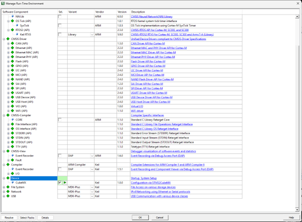

The Device → CubeMX option in the Manage Run-Time Environment (RTE) settings enables configuration with STM32CubeMX inside Keil. This option ensures that the generated Keil project remains synchronized with STM32CubeMX settings, allowing for seamless peripheral and middleware integration.

Why Enable This?

If you're migrating from STM32CubeIDE or using CubeMX for peripheral initialization, this setting is essential to keep the Keil project structured and updated with your STM32CubeMX configurations.

1. Navigate to Project in the menu bar.

2. Click on Manage → Run-Time Environment.

3. This will open the Manage Run-Time Environment (RTE) window.
